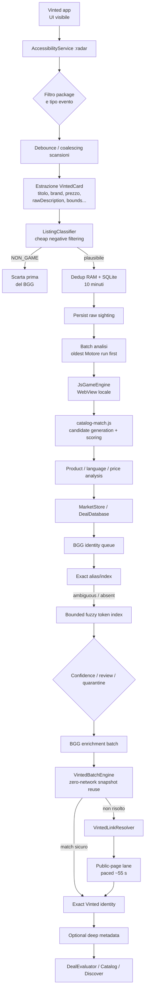
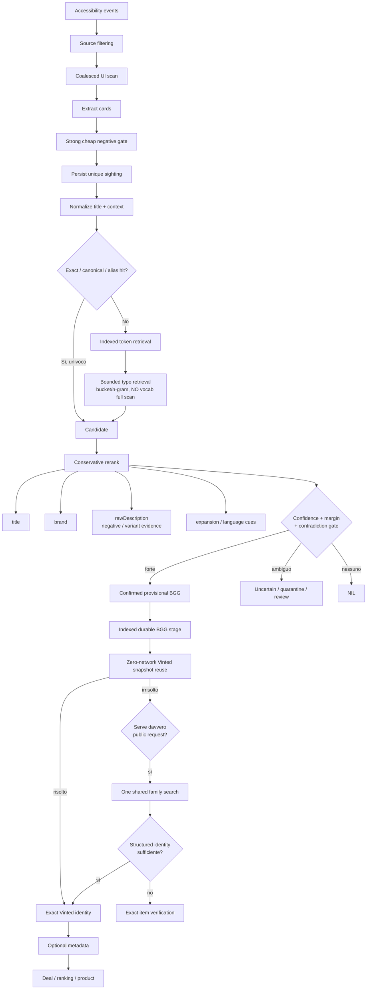
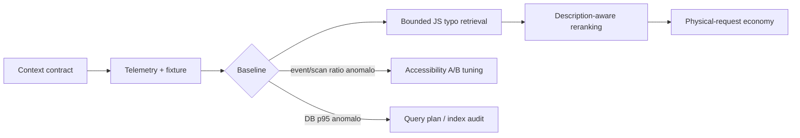

> Nota di integrazione (2026-10-02): report originale fornito dall'utente, conservato come ricerca storica. Baseline principalmente 5.12.41, da riconfermare sull'ultimo beta. Non è una specifica approvata né sostituisce STATE.md o il backlog backend. Le citazioni incorporate rimandano alla sessione di ricerca originale e non sono risolvibili qui. Prossimo passo e limiti: STATE.md e docs/specs/backend-reliability-recognition.md.

# Ludo Scout Engine — Research & Implementation Brief

## Executive summary

L’analisi della repository privata `werhealthy/ludo-scout` porta a una conclusione importante: **molte delle ottimizzazioni “ovvie” che suggerirebbe un audit superficiale sono già state implementate**. In particolare, Ludo Scout non sta più facendo un confronto ingenuo contro tutti i circa 31.000 giochi BGG a ogni riconoscimento nella pipeline Java: il matching BGG della coda usa già un catalogo caricato una volta, lookup per ID, indice hash per gli exact match, candidate generation tramite token postings e un pool fuzzy limitato. Versioni precedenti soffrivano davvero di scansioni complete e timeout, ma il changelog documenta esplicitamente la loro rimozione. fileciteturn21file0 fileciteturn27file0

I problemi più promettenti oggi sono altri.

**Il primo collo di bottiglia per il tempo percepito è probabilmente la risoluzione dell’identità Vinted, non BGG.** La pipeline impone intenzionalmente un intervallo minimo di circa **55 secondi tra richieste fisiche alle pagine pubbliche Vinted**, con budget e circuit breaker condivisi fra processi. Questa è una scelta prudente e va preservata: la strada corretta non è aumentare la frequenza delle richieste, ma **ridurre quante richieste fisiche servono per completare una card**. L’app ha già iniziato ad andare in questa direzione con snapshot, caching, fast path e `VintedBatchEngine`; il contatore `linkRequestsPerNewLink` esiste già ed è la metrica chiave da ottimizzare. fileciteturn54file0 fileciteturn48file0 fileciteturn53file0

**Il secondo punto concreto è nel matcher JavaScript usato durante lo scroll.** In `catalog-match.js`, quando una parola significativa del titolo non esiste nell’indice, il recupero dei refusi percorre l’intera mappa `byWord`, eseguendo edit-distance sui token compatibili. Questo non equivale a scansionare 31.000 giochi per ogni titolo, ma costituisce comunque un percorso con costo proporzionale al vocabolario per ogni token fuori vocabolario. Titoli Vinted rumorosi, descrittivi o con errori possono quindi amplificare il lavoro locale. È il candidato più chiaro per una **ottimizzazione locale circoscritta e misurabile**. fileciteturn59file0 fileciteturn57file0

**Il terzo punto riguarda l’affidabilità del riconoscimento.** `VintedCard` possiede `rawDescription`, condizione e altri segnali; `ListingClassifier` usa già titolo + descrizione per bloccare non-giochi, accessori, componenti, bundle, scatole vuote e altri casi prima del matching costoso. Tuttavia, quando `JsGameEngine` invia la card al motore JS, passa sostanzialmente `title`, `brand`, prezzo e spedizione: `rawDescription` non arriva al matcher BGG positivo. Nel bridge, `matcher.match()` lavora quindi sul titolo con brand come contesto, mentre anche product matching e language assessment ricevono essenzialmente il titolo. Questo crea un gap: **la descrizione viene usata bene come filtro grossolano, ma non come evidenza secondaria per disambiguare due giochi plausibili, un’espansione, un’edizione o un conflitto**. fileciteturn39file0 fileciteturn37file0 fileciteturn61file0 fileciteturn56file0

**L’Accessibility event storm non appare invece, allo stato attuale, come un bug lasciato completamente aperto.** Il servizio è già limitato al package `fr.vinted`, ascolta quattro categorie di evento, usa `notificationTimeout`, debounce/coalescing, sopprime riavvistamenti e rianalisi della stessa card per dieci minuti e ha reso persistente il dedupe in SQLite. Inoltre i diagnostici degli eventi sono già batchati. C’è ancora margine per filtrare meglio `TYPE_WINDOW_CONTENT_CHANGED` usando `contentChangeTypes` o sperimentare un `notificationTimeout` più coerente con il debounce applicativo, ma questa è una **strong hypothesis da misurare**, non la prima refactor da fare. La documentazione Android raccomanda proprio di registrarsi solo agli eventi necessari e sottolinea che il notification timeout evita notifiche IPC troppo frequenti. fileciteturn30file0 fileciteturn47file0 citeturn7search1turn7search4

Infine emerge un problema diverso ma importante per il tuo workflow con ChatGPT Work: **il contratto di contesto della repository è incoerente**. Nel branch principale analizzato non risultano `PROJECT.md`, `AGENTS.md` e `STATE.md`; il repository usa invece `AI_HANDOFF.md`. Inoltre `README.md` dichiara ancora `5.12.3`, `AI_HANDOFF.md` identifica come baseline `5.12.35`, mentre `app/build.gradle` è già a `5.12.41-invisible-interactions`, `versionCode 154`. Questo aumenta concretamente il rischio che un agente inizi un task leggendo una fotografia storica della codebase. fileciteturn55file0 fileciteturn18file0 fileciteturn26file0

Per un coding agent questo non è un dettaglio: OpenAI documenta `AGENTS.md` come meccanismo per spiegare a Codex come navigare il codebase, quali test eseguire e quali pratiche seguire; ChatGPT Work è oggi il prodotto OpenAI destinato ai task più lunghi e multi-step. citeturn9search8turn9search3 Il brief corrente nasce proprio dall’obiettivo espresso nel materiale di backing: trasformare diagnosi e ricerca in piccoli interventi verificabili, invece di fare una mega-refactor non misurabile. fileciteturn0file0

La priorità proposta è quindi:

**contratto di contesto → baseline strumentata → bounded typo retrieval nel JS matcher → reranking context-aware conservativo → riduzione delle richieste Vinted per identità completata.**

Non raccomando, per ora, vector database, embeddings, OCR nel matching BGG, Room migration, riscrittura del motore in Kotlin o un nuovo backend.

## Current architecture

La pipeline corrente è più sofisticata di un semplice “scroll → fuzzy match → database”. Il sistema separa già acquisizione, classificazione, matching locale, persistenza e arricchimento remoto.



**Acquisizione.** `VintedAccessibilityService` opera nel processo `:radar`. Il servizio è configurato solo per `fr.vinted` e per `TYPE_WINDOW_STATE_CHANGED`, `TYPE_WINDOW_CONTENT_CHANGED`, `TYPE_VIEW_SCROLLED` e `TYPE_WINDOWS_CHANGED`. La configurazione usa un `notificationTimeout` di 35 ms. fileciteturn29file0 fileciteturn30file0

Nel servizio esistono già due livelli di contenimento del rumore: il callback Accessibility non è sinonimo di una scansione completa immediata, e scansioni/ripetizioni della stessa card vengono coalesciate e deduplicate. Il progetto documenta inoltre che la persistenza del raw sighting non dipende dall’essere già pronto il runtime BGG: acquisizione e analisi sono deliberatamente due stadi diversi. fileciteturn65file0 fileciteturn47file0

**Cheap filtering.** Ogni `VintedCard` contiene titolo, brand, condizione, prezzo, prezzo protetto, favoriti, coordinate, testo grezzo e seller name. Prima che una card possa diventare un candidato BGG viene eseguito `ListingClassifier`, che usa anche `rawDescription` per riconoscere forti segnali di non-gioco, videogioco, accessorio, componenti, scatola vuota e bundle. Il codice del servizio scarta `NON_GAME` prima di `recordSighting()`. fileciteturn39file0 fileciteturn37file0 fileciteturn35file1

**Persistenza e dedupe.** `DealDatabase` usa `SQLiteOpenHelper`, database version 20, WAL e indici per i percorsi principali. `MarketStore` sovrappone un modello canonico Game → Listing → PriceObservation e una coda durevole di enrichment. L’acquisizione ripetuta della stessa firma entro dieci minuti viene soppressa anche a livello SQLite, quindi sopravvive a un riavvio del processo `:radar`. fileciteturn25file0 fileciteturn23file0

**Analisi JS.** `JsGameEngine` crea un WebView nascosto, carica gli asset locali del motore e invoca `VintedAffariAndroidBridge.analyzeBatch()` tramite `evaluateJavascript()`. Android specifica che la chiamata a `evaluateJavascript` e il callback avvengono sul UI thread; questo rende utile misurare il round-trip e il parsing prima di aumentare il lavoro per batch. fileciteturn61file0 citeturn7search0

Il batch Java passa al JS `title`, `brand`, prezzo, protected price e shipping; il bridge chiama poi `matcher.match(title,{brand})`. Il motore non riceve in quel punto la descrizione completa della card. fileciteturn61file0 fileciteturn56file0

**Matching locale JS.** `catalog-match.js` costruisce strutture in memoria per lookup e token. Il percorso exact/token-based è già indicizzato, ma il recupero dei refusi per un query-token significativo sconosciuto attraversa `byWord`, filtra per iniziale/lunghezza e poi usa edit distance. fileciteturn59file0 fileciteturn57file0

**Matching BGG durevole.** La pipeline successiva è diversa dal matcher JS. `BggSearchClient` mantiene un catalogo locale condiviso, un indice `BGG id → Game`, un indice hash per exact name/alias e un token postings index per la fuzzy search della queue. Per il fuzzy queue matching seleziona fino a tre range di token rari, limita il candidate pool e conserva solo i top candidate, con un budget CPU di sicurezza di 2,5 secondi. fileciteturn21file0

Questo è cruciale: **non va reimplementato un inverted index BGG come se mancasse**.

**Coda.** La coda BGG è single-flight. `QueueJobRunner` prova prima reuse autorevole, poi exact, poi fuzzy solo in assenza di ambiguità exact; una fuzzy decision richiede sia score sufficiente sia margine rispetto al secondo candidato. Un timeout tecnico non viene trasformato in falsa certezza. fileciteturn20file0

**Vinted identity.** Prima di spendere un’altra richiesta pubblica, `QueueJobRunner` esegue `VintedBatchEngine.applyCached()`. Questo motore è esplicitamente zero-network e prova a collegare annunci attraverso snapshot del catalogo già ottenuti, richiedendo prezzo compatibile, forte corrispondenza semantica, margine e safety gate. fileciteturn20file0 fileciteturn48file0

Solo ciò che resta irrisolto entra nel resolver remoto. `VintedLinkResolver` tenta fino a due query catalogo, con seconda query solo dopo un vero miss; quando una risposta strutturata è già sufficientemente forte può accettare l’identità senza una successiva pagina articolo, altrimenti verifica la pagina pubblica esatta. fileciteturn53file0

**Network pacing.** Tutti i processi condividono tramite SQLite un unico gate `VintedPublicSession`: intervallo minimo 55 secondi, cache URL di dieci minuti, budget massimo di 60 richieste fisiche/ora e circuit breaker per 403/429. Il ledger distingue cache/physical, catalog/item, purpose e calcola direttamente `linkRequestsPerNewLink`. fileciteturn54file0

## Evidence found, bottlenecks e recognition failure modes

La tabella distingue ciò che è già dimostrabile dal codice da ciò che richiede una misura sul Pixel corrente.

| Finding | Stato | Impatto stimato | Evidenza |
|---|---|---:|---|
| I file di contesto richiesti `PROJECT.md`, `AGENTS.md`, `STATE.md` non risultano nel tree analizzato e i documenti esistenti dichiarano baseline diverse | **Evidence-backed** | Alto per ChatGPT Work, nullo runtime | README 5.12.3, AI_HANDOFF 5.12.35, Gradle 5.12.41. fileciteturn55file0 fileciteturn18file0 fileciteturn26file0 |
| Il matching BGG Java non fa più una full scan ingenua del catalogo a ogni query | **Evidence-backed** | Esclude una falsa pista | Exact hash index, by-id map e token postings sono già presenti. fileciteturn21file0 |
| Il matcher JS ha un fallback typo che attraversa `byWord` per token OOV | **Evidence-backed** | Potenzialmente alto sulla CPU locale | Loop esplicito su `byWord` + edit distance. fileciteturn59file0 |
| Il positive matching JS non riceve `rawDescription` | **Evidence-backed** | Medio/alto sulla precisione, da misurare | `JsGameEngine` serializza titolo/brand/prezzi; bridge fa `match(title,{brand})`. fileciteturn61file0 fileciteturn56file0 |
| La pipeline Vinted ha un gate fisico di ~55 s/request | **Evidence-backed** | Alto sul wall-clock | `PUBLIC_MIN_INTERVAL_MS=55_000`. fileciteturn54file0 |
| Event storm Accessibility non è completamente “libero” | **Evidence-backed** | Riduce priorità del problema | Filtri, timeout, debounce e dedupe esistono già. fileciteturn30file0 fileciteturn47file0 |
| Il fallback typo JS pesa significativamente nel caso reale | **Strong hypothesis** | Potenzialmente alto | Serve latency + OOV telemetry per verificarlo. |
| La descrizione può abbattere falsi positivi senza danneggiare recall | **Strong hypothesis** | Alto sulla qualità | L’informazione esiste ma non entra nel positive matcher. |
| `notificationTimeout`/`contentChangeTypes` possono ridurre molte scansioni inutili | **Strong hypothesis** | Medio | Serve event→scan→new-card ratio. |
| FTS5/trigram sostituirà vantaggiosamente l’indice corrente | **Research opportunity** | Incerto | Soluzione tecnicamente valida, ma non ancora giustificata. |
| Embeddings/ML/OCR miglioreranno il matching BGG | **Research opportunity** | Incerto / complessità alta | Nessuna evidenza attuale che servano. |

### Bottleneck principale: public-page work

Il dato più forte è strutturale: un singolo physical request Vinted occupa intenzionalmente circa 55 secondi di capacità della corsia. `DealDatabase` incorpora infatti questa realtà anche nel modello di ETA, usando il lavoro Vinted core per stimare il tempo residuo. fileciteturn25file0 fileciteturn54file0

Questo significa che passare, per esempio, da “due richieste fisiche per una identità” a “una richiesta fisica” è architetturalmente molto più importante che risparmiare qualche millisecondo SQLite. Non sto affermando che il rapporto corrente sia due: **manca nel repository un export diagnostico fresco di 5.12.41 che permetta di dirlo**. Fortunatamente il codice possiede già il contatore esatto per misurarlo. fileciteturn54file0

Il `AI_HANDOFF` stesso identifica l’efficienza di request come questione ancora aperta e prescrive di ottenere throughput futuro tramite condivisione delle discovery/snapshot, reuse e meno fallback, non aumentando il request rate. fileciteturn18file0

### Bottleneck locale: fallback typo del matcher JS

Il percorso:

```text
query token sconosciuto
→ loop su tutti i token di byWord
→ filtro iniziale/lunghezza
→ editDistance
→ union delle entry associate
→ scoring dei candidati
```

è concettualmente una forma di fuzzy blocking che, per i token OOV, perde il vantaggio dell’accesso diretto. fileciteturn59file0

Non serve sostituire tutto il matcher. È sufficiente portare anche questo percorso verso una candidate generation bounded, per esempio preindicizzando il vocabolario per `(prima lettera, lunghezza)` oppure n-gram. Così l’attuale edit distance e l’attuale scoring possono restare invariati.

### Accessibility event storm: rischio residuo, non root cause dimostrata

L’app è già configurata bene rispetto a una grossa parte delle raccomandazioni Android: package-specific filtering ed event-type filtering esistono. Android ricorda inoltre che `notificationTimeout` serve proprio a evitare propagazioni eccessivamente frequenti attraverso IPC e a lasciare che la generazione di eventi si stabilizzi. citeturn7search1turn7search4

Qui vedo due esperimenti, non una refactor obbligatoria: portare il timeout più vicino al debounce applicativo e distinguere meglio i `TYPE_WINDOW_CONTENT_CHANGED` tramite i relativi change types. Senza conoscere `eventsReceived / scansExecuted / scansWithNewCards`, però, cambiare ora questo comportamento potrebbe ridurre il recall di acquisizione per inseguire un problema non dominante.

### Failure modes del riconoscimento

**Titolo corretto ma contesto contraddittorio.** Un titolo può contenere il nome esatto di un gioco mentre la descrizione chiarisce “solo carte”, “espansione”, una specifica edizione o un prodotto collegato. I casi grossolani vengono già bloccati da `ListingClassifier`, ma la descrizione non partecipa al ranking BGG positivo del JS matcher. fileciteturn37file0 fileciteturn61file0

**Giochi con nomi simili.** La pipeline possiede già score, gap, review/quarantine e quindi non va riscritta come se “scegliesse sempre il primo”. Il punto da migliorare è fornire più evidenza al reranker quando due candidati sono plausibili, preservando l’astensione. fileciteturn20file0

**Base game vs espansione/edizione.** `ListingClassifier` riconosce termini espliciti di espansione, e stadi successivi gestiscono varianti, ma il bridge iniziale non sfrutta la descrizione per distinguere finemente la variante. È quindi più sensato aggiungere *negative/ambiguity evidence* che abbassare indiscriminatamente le soglie fuzzy. fileciteturn37file0 fileciteturn56file0

**Refusi e seller noise.** Il sistema prova già a correggerli, ma proprio questo percorso è quello che può diventare computazionalmente più costoso. fileciteturn59file0

**Lingue e titoli non latini.** Il matcher normalizza aggressivamente le stringhe; possibili problemi su titoli fuori dallo spazio latino vanno considerati una research opportunity, non un bug dimostrato nel traffico attuale.

**Immagini.** L’app usa già screenshot e visual similarity, ma principalmente per confermare l’identità di un candidato Vinted: `VintedPhotoMatcher` specifica che titolo e prezzo restano obbligatori e che la foto è un segnale secondario per rompere parità. Non è quindi oggi il meccanismo principale di BGG game recognition. fileciteturn44file0

`ThumbnailStore` ha già single-flight screenshot capture, throttling, heap guard e RGB_565; ottimizzare aggressivamente questo sottosistema senza una nuova evidenza sarebbe probabilmente lavorare su un problema già affrontato. fileciteturn45file0

## Relevant external research

Il pattern generale che emerge dalla letteratura sull’entity linking è coerente con la direzione che Ludo Scout ha già iniziato a prendere: **retrieve pochi candidati plausibili → fai il confronto costoso soltanto su quelli → usa il contesto per disambiguare → consenti un risultato NIL/uncertain**. La letteratura tratta esplicitamente la candidate generation come primo stadio dell’entity linking; lavori scalabili separano retrieval e reranking proprio per non confrontare ogni input con tutta la knowledge base. citeturn7search10turn7academia51

| Tecnica | Come funziona | Fit con Ludo Scout | Costo / RAM / scala 30k–100k | Offline | Raccomandazione |
|---|---|---|---|---|---|
| **Exact/hash + token inverted index** | Normalizza e indicizza nomi/alias; la query recupera solo posting rilevanti | È già la base del nuovo `BggSearchClient` | Build O(catalogo); query dipendente dai posting, non dal catalogo intero | Sì | **Mantenere. Non reimplementare**. fileciteturn21file0 |
| **Blocking prima del reranking** | Genera un piccolo candidate set prima dello scoring più costoso | È il principio corretto sia per BGG sia per typo recovery | Adatto per evitare crescita lineare/quadratica delle comparazioni; va benchmarkato sul corpus reale | Sì | **Applicare al fallback typo JS**. Il blocking nasce proprio per evitare confronti all-pairs. citeturn7search2turn7search10 |
| **Bucket/n-gram index per typo** | Preindicizza token simili per caratteristiche/n-gram; edit distance solo nel bucket | Sostituisce il loop sull’intero `byWord` senza cambiare il ranking | Aggiunge un indice compatto in RAM; query bounded sul candidato bucket | Sì | **Alta priorità** |
| **Context-aware reranking** | Candidate generation sul nome, poi contesto per distinguere candidati | `rawDescription` esiste ma non entra nel matcher JS positivo | Costo limitato se applicato solo ai pochi candidati recuperati | Sì | **Alta priorità, soprattutto come negative evidence**. La separazione retrieval/rerank è un pattern consolidato. citeturn7academia51turn7search9 |
| **NIL / abstention** | Il sistema può dichiarare che nessun candidato è abbastanza sicuro | Ludo possiede già review/quarantine/uncertain | Quasi nessun costo computazionale; la difficoltà è calibrare le soglie | Sì | **Preservare e rafforzare**, non forzare sempre un winner |
| **SQLite FTS5 trigram** | Indicizza trigrammi e supporta substring matching indicizzato | Potrebbe diventare un motore di candidate retrieval on-disk | Evita molte scansioni lineari, ma introduce schema/version/runtime considerations | Sì | **Esperimento futuro**, non prima scelta. SQLite documenta esplicitamente il tokenizer trigram. citeturn8search0 |
| **PRAGMA optimize / query-plan audit** | Mantiene statistiche del planner e verifica l’uso degli indici | Utile solo se la telemetria indica SQL hot path | Basso costo; nessun vantaggio garantito se le query sono già indicizzate | Sì | **Maintenance**, non refactor. SQLite consiglia `PRAGMA optimize` soprattutto dopo cambi schema/index. citeturn8search1turn8search2 |
| **Embeddings / dense retrieval** | Embedding di mention e catalogo, ANN, poi reranking | Potrebbe gestire sinonimi/rumore molto complessi | Modello + indice + RAM + lifecycle più complessi; sproporzionati senza evidenza | Possibile | **Rimandare**. La letteratura mostra che funziona su scale enormi, ma Ludo ha solo ~31k entità e già forti alias/indici deterministici. citeturn7academia51 |
| **Accessibility source filtering** | Riduce gli eventi prima che arrivino al processing | Config attuale è già package/type-specific | Costo quasi nullo; rischio è perdere segnali utili | Sì | **A/B solo dopo misura**. citeturn7search1turn7search4 |

Un dettaglio importante è SQLite: non consiglierei una migrazione a Room “per performance”. L’attuale app usa `SQLiteOpenHelper`, WAL e diversi indici; SQLite stesso raccomanda di valutare query e indici in funzione delle clausole effettive e offre `PRAGMA optimize` per mantenere informazioni utili al planner. Non è emersa evidenza sufficiente per dichiarare il database il collo di bottiglia corrente. fileciteturn25file0 citeturn8search1turn8search2

Analogamente, non consiglierei di portare immediatamente il motore JS in Java. `evaluateJavascript()` deve essere invocato sul UI thread e consegna lì anche il callback, quindi un batch molto pesante merita strumentazione; ma da questo solo fatto **non segue** che il WebView sia il collo di bottiglia o che una riscrittura nativa sia automaticamente più veloce. Prima si misura `JS round-trip p50/p95/max`. citeturn7search0

## Proposed target pipeline

La pipeline target non richiede una nuova architettura. È soprattutto una **compressione progressiva del candidate space**, preservando il lavoro buono già fatto.



L’idea centrale è che **`rawDescription` non deve diventare un nuovo generatore indiscriminato di match**. Sarebbe pericoloso: le descrizioni Vinted possono contenere riferimenti ad altri giochi, comparazioni o termini generici.

La descrizione dovrebbe entrare prevalentemente in tre forme:

```text
positive candidate retrieval:
    titolo + alias + brand

secondary evidence:
    descrizione → edizione / espansione / lingua / prodotto completo

negative evidence:
    descrizione → accessorio / componenti / "solo..." / bundle / conflitto

decision:
    candidate score + margin - contradiction penalties
```

In altre parole: **il titolo propone; il contesto può confermare, disambiguare o bloccare; la descrizione non dovrebbe inventare autonomamente un’identità BGG.**

Per il network il principio analogo è:

```text
reuse locale
→ reuse snapshot famiglia
→ structured catalog identity
→ una nuova query pubblica solo quando serve
→ fallback query solo se ha yield dimostrato
→ exact item page solo quando è necessaria per correctness
```

Il vincolo fondamentale resta quello già scritto negli invariants del progetto: nessun aumento artificiale del request rate; throughput tramite riduzione del lavoro e reuse. fileciteturn18file0

## Measurement plan

La principale limitazione dell’audit è che la repository contiene molti risultati storici di Pixel test ma **non ho trovato un field diagnostic fresco di 5.12.41 sufficiente per attribuire percentualmente il tempo corrente a Accessibility, JS, BGG, SQLite e Vinted**. Quindi la prima modifica runtime dovrebbe essere di osservabilità, non di tuning delle soglie.

La misurazione deve rimanere aggregata e a basso overhead.

| Stadio | Metrica | Esiste già? | Perché serve |
|---|---|---|---|
| Accessibility | `eventsReceivedByType` | Parzialmente | Volume sorgente |
| Accessibility | `scanScheduled`, `scanExecuted` | Da consolidare | Misura coalescing |
| Scan | `scansWithZeroNewCards` | Da aggiungere | È la misura più utile dell’event storm |
| Scan | `cardsDiscovered / uniqueSightings` | Parzialmente | Misura duplicazione |
| Classifier | `nonGameRejected`, altri gate | Parzialmente | Quanto lavoro costoso viene evitato |
| JS | `batchItems`, `batchElapsedMs` p50/p95/max | **Manca come baseline affidabile** | Determina costo reale del matcher |
| JS matcher | `exactHit`, `tokenHit`, `typoFallback` | Da aggiungere | Frequenza dei percorsi |
| JS matcher | `typoVocabularyComparisons` | Da aggiungere | Verifica il sospetto sul loop `byWord` |
| JS matcher | candidate count before/after | Da aggiungere | Misura candidate-space reduction |
| BGG queue | index load, exact scans/cache, fuzzy candidates/timeouts | Già ricca | Non duplicare metriche esistenti. fileciteturn21file0 |
| Vinted batch | `considered`, `covered`, `applied`, `elapsedMs` | Già presente | Yield zero-network. fileciteturn48file0 |
| Vinted HTTP | physical/cache, catalog/item | Già presente | Cost of identity |
| Vinted HTTP | `linkRequestsPerNewLink` | **Già presente** | KPI principale. fileciteturn54file0 |
| End-to-end | first sighting → BGG match | Da derivare | Latency locale |
| End-to-end | first sighting → exact Vinted | Da derivare | Latency remota |
| End-to-end | first sighting → ready | Da derivare | UX effettiva |
| Recognition | exact correctness / false positive / false negative / abstain | Serve fixture | Qualità, non solo velocità |

Accanto alla telemetria serve un piccolo **recognition fixture corpus** versionato. Non migliaia di righe: inizialmente sono più utili qualche decina di casi reali difficili, ciascuno con:

```text
seller title
rawDescription essenziale
brand se disponibile
expected BGG id oppure NONE
listing type atteso
note: exact / typo / expansion / accessory / ambiguous
```

Il dataset dovrebbe includere soprattutto gli errori reali che hai già osservato, perché sono quelli su cui dobbiamo evitare regressioni.

Le metriche decisive prima di Intervention C–E sono:

```text
Accessibility amplification =
    events received / scans actually executed

Useful scan ratio =
    scans producing >=1 new unique listing / scans executed

JS typo amplification =
    vocabulary comparisons / typo-fallback query

Recognition precision =
    correct accepted matches / all accepted matches

Recognition recall =
    correct accepted matches / all known matchable listings

Abstention rate =
    uncertain-or-none / total recognition cases

Network efficiency =
    physical link requests / newly exact-linked listings

Zero-network coverage =
    listings solved by cached batch / eligible unresolved listings
```

Le soglie riportate nel backlog seguente sono **criteri di accettazione proposti**, non benchmark già raggiunti.

## Implementation backlog e order of implementation

Il backlog è volutamente limitato a cinque interventi. Ogni intervento deve essere implementato separatamente; non vanno fusi in una singola “engine refactor”.

### Sintesi operativa

| Ordine | Intervento | Tipo | Rischio | Potenziale |
|---:|---|---|---|---|
| A | Context contract | Processo / agent reliability | Molto basso | Alto per Work |
| B | Pipeline telemetry + recognition fixture | Measurement | Basso | Abilita tutti gli altri |
| C | Bounded JS typo retrieval | Performance locale | Medio-basso | Alto se OOV frequente |
| D | Description-aware conservative reranking | Correctness | Medio | Alto sui falsi positivi |
| E | Physical-request economy | Throughput | Medio | Molto alto sul wall-clock |

**Intervention A — Repository context contract**

**Problem**

L’agente non ha una source of truth compatta e aggiornata. `README.md`, `AI_HANDOFF.md` e il build reale non concordano sulla baseline; i tre file previsti dal workflow (`PROJECT.md`, `AGENTS.md`, `STATE.md`) non risultano nella root analizzata. fileciteturn55file0 fileciteturn18file0 fileciteturn26file0

**Evidence**

`README.md` parla di 5.12.3; `AI_HANDOFF.md` dichiara 5.12.35; `build.gradle` contiene 5.12.41. OpenAI documenta `AGENTS.md` come luogo appropriato per navigazione, test e pratiche del repository. citeturn9search8

**Proposed change**

Creare:

`AGENTS.md`: regole operative brevi, branch workflow, test obbligatori, invariants che non devono essere violati, ordine dei documenti da leggere.

`PROJECT.md`: architettura relativamente stabile, processi, pipeline, database, network invariants, distinzione JS matcher / BGG queue matcher.

`STATE.md`: **solo stato volatile**: build corrente, ultime misure valide, problemi aperti, esperimenti correnti, intervento successivo.

Aggiornare `README.md` affinché non contenga una baseline hardcoded obsoleta oppure la derivi/rimandi alla source of truth. Ridurre `AI_HANDOFF.md` a storia tecnica oppure dichiararne esplicitamente il ruolo storico.

**Why this approach**

Se contesto stabile e stato volatile sono separati, Work non deve dedurre “cosa è ancora vero” da centinaia di righe di changelog.

**Likely affected components/files**

`AGENTS.md` nuovo; `PROJECT.md` nuovo; `STATE.md` nuovo; `README.md`; `AI_HANDOFF.md`. Eventuale regression/script che controlli la coerenza della versione.

**Expected effect**

Nessun guadagno runtime. Riduzione sostanziale del rischio di patch basate su assunzioni obsolete.

**Risk**

Quasi nullo; il rischio principale è duplicare informazioni anziché stabilire una vera gerarchia.

**Metrics before/after**

Prima: almeno tre baseline discordanti nei documenti analizzati. Dopo: un solo `STATE.md` deve dichiarare lo stato corrente e tutti gli altri documenti devono rimandare a esso.

**Verification**

Work deve poter rispondere, leggendo solo i documenti prescritti, a: versione corrente, branch di lavoro, pipeline, invariants network, test minimi, ultimo problema noto.

**Rollback**

Docs-only revert.

**External references**

OpenAI raccomanda `AGENTS.md` per guidare gli agenti di coding e sottolinea il valore di documentazione e test affidabili. citeturn9search8

**Intervention B — Stage telemetry e recognition fixture**

**Problem**

Esistono molti diagnostici, ma manca una baseline unica dell’attuale 5.12.41 che permetta di confrontare event ingestion, JS local matching, BGG queue e network identity nella stessa run.

**Evidence**

Il progetto dispone già di metriche BGG molto ricche, `VintedBatchEngine` diagnostics e un request ledger Vinted, ma il costo per batch JS, la frequenza del typo fallback e l’amplificazione event→scan non sono esposti nello stesso modello operativo. fileciteturn21file0 fileciteturn48file0 fileciteturn54file0

**Proposed change**

Aggiungere aggregati per-run a basso overhead, non un log per evento. In particolare:

`events → scans → scansWithNewCards → uniqueSightings → classifierAccepted → JS items → BGG matched → Vinted batch solved → physical requests → exact linked → ready`.

Nel matcher JS aggiungere contatori per exact/token/typo path, candidate count e numero di vocabulary entries visitate dal typo path.

Creare una fixture di recognition con casi reali difficili e expected BGG ID/NONE.

**Why this approach**

Permette di decidere in base a dati reali se il problema dominante successivo è event storm, JS matching o request amplification.

**Likely affected components/files**

`VintedAccessibilityService.java`, `JsGameEngine.java`, `catalog-match.js`, `MarketStore.java` o l’attuale componente diagnostico; nuova fixture/regression sotto `regression/` o tests.

**Expected effect**

Overhead trascurabile se gli aggregati vengono aggiornati per batch/run. Nessuna modifica attesa alla correctness.

**Risk**

Trasformare la telemetria stessa in lavoro costoso. Evitare write SQLite/SharedPreferences per ogni singolo Accessibility event; il progetto ha già imparato questa lezione e ha introdotto batching diagnostico. fileciteturn43file4

**Metrics before/after**

Prima: mancano `JS batch p95`, `typoFallback rate`, `typo comparisons`, `scan zero-yield ratio`. Dopo: tutti disponibili per una run di Motore.

**Verification**

Stesso output delle regression esistenti; confronto di due run equivalenti; contatori internamente coerenti (`uniqueSightings <= discovered`, ecc.).

**Rollback**

Feature-flag o rimozione dei nuovi aggregati, senza schema distruttivo.

**External references**

Android raccomanda di limitare il rumore Accessibility a monte; la misura event→useful scan permette di sapere se valga davvero la pena stringere ulteriormente il filtro. citeturn7search1turn7search4

**Intervention C — Bounded typo candidate generation nel matcher JS**

**Problem**

Per ogni token core sconosciuto di lunghezza sufficiente, `catalog-match.js` scorre `byWord` per cercare token a edit-distance ridotta. fileciteturn59file0

**Evidence**

Il loop e l’implementazione dell’edit distance sono direttamente visibili nel matcher corrente. fileciteturn59file0 fileciteturn57file0

**Proposed change**

Durante l’inizializzazione del catalogo costruire un indice addizionale molto semplice, per esempio:

```text
first character
    → token length
        → candidate vocabulary tokens
```

oppure un piccolo postings index di n-gram.

Quando serve typo recovery:

```text
query token
→ lookup bucket
→ editDistance solo sui token del bucket
→ stesse entry
→ stesso scorer esistente
```

Non cambiare inizialmente soglie, score, confidence o semantics.

**Why this approach**

Riduce il lavoro del fallback senza cambiare il modello decisionale. È quindi possibile verificare la performance in isolamento.

**Likely affected components/files**

`app/src/main/assets/engine/catalog-match.js`; test/regression del matcher. Eventualmente il loader/catalog asset solo se necessario.

**Expected effect**

Riduzione forte del numero di confronti token sui titoli OOV; nessun cambiamento intenzionale dei risultati.

**Risk**

Bucket troppo aggressivi potrebbero impedire di trovare un typo che il vecchio algoritmo recuperava.

**Metrics before/after**

`typoVocabularyComparisons`, `candidateEntries`, `JS batch p50/p95/max`, fixture recall.

Come **acceptance target proposto**, non benchmark promesso: ridurre di almeno ~80% i confronti di vocabolario nelle query che entrano nel typo path mantenendo gli stessi risultati della fixture.

**Verification**

Eseguire il vecchio e nuovo matcher sugli stessi input e diffare:

```text
status
BGG id
top candidates
score
reason
```

Qualunque differenza richiede spiegazione.

**Rollback**

Ripristinare il vecchio typo candidate generator: il resto del matcher rimane intatto.

**External references**

Il principio di blocking/candidate generation serve proprio a evitare confronti con l’intero universo prima del ranking costoso. citeturn7search2turn7search10

**Intervention D — Description-aware conservative reranking**

**Problem**

Il sistema possiede `rawDescription`, ma il core positive matching nel WebView riceve titolo e brand, non il contesto descrittivo. fileciteturn39file0 fileciteturn61file0

**Evidence**

`ListingClassifier` dimostra già che la descrizione contiene segnale utile per identificare accessori, componenti, bundle ed espansioni. Il bridge JS non la riceve nel percorso `matcher.match(title,{brand})`. fileciteturn37file0 fileciteturn56file0

**Proposed change**

Passare `rawDescription` al bridge e usarla **solo dopo candidate generation**.

Regola iniziale:

```text
description cannot create a BGG candidate by itself
description can:
    increase confidence slightly when corroborating
    lower confidence on contradictory variant cues
    mark expansion ambiguity
    mark component/accessory conflict
    help language/edition disambiguation
```

Preservare un esplicito outcome `uncertain`/quarantine quando il contesto contraddice il winner.

**Why this approach**

Riduce il rischio di falsi positivi senza ampliare indiscriminatamente il recall.

**Likely affected components/files**

`JsGameEngine.java`, `android-bridge.js`, eventualmente `catalog-match.js`, `product-match.js`/language logic se la struttura corrente lo rende appropriato, `BoardGameIntakeGate.java`, fixture/regressions.

**Expected effect**

Migliore precisione soprattutto nei titoli che contengono il nome corretto di un gioco ma descrivono un prodotto diverso o una variante.

**Risk**

Descrizioni marketplace possono contenere rumore o altri giochi. Per questo non devono essere un source di positive candidate generation.

**Metrics before/after**

Fixture precision, recall, false positive rate, false negative rate, abstention rate; separare casi base-game, expansion, accessory e ambiguous.

**Verification**

Nessuna regressione sugli exact title puliti; casi contraddittori devono diventare `uncertain`/blocked anziché match forte quando la fixture lo richiede.

**Rollback**

Disabilitare il context reranking e continuare a passare solo title/brand.

**External references**

I sistemi di entity linking scalabili separano candidate retrieval dal reranking contestuale; la letteratura tratta esplicitamente il contesto come informazione del ranking dopo la candidate generation. citeturn7academia51turn7search9

**Intervention E — Riduzione dei physical Vinted requests per exact identity**

**Problem**

Un physical request consuma circa 55 secondi di capacità della corsia; quindi il numero di richieste per identità risolta ha un impatto diretto sul wall-clock. fileciteturn54file0

**Evidence**

Il resolver può fare una seconda catalog query dopo un vero miss e, quando il catalog non è abbastanza autorevole, una item-page verification. Allo stesso tempo esistono già zero-network batch matching, URL cache e structured fast path. fileciteturn53file0 fileciteturn48file0

**Proposed change**

Non partire cambiando il pacing.

Estendere prima il ledger per attribuire yield e costo a:

```text
catalog query #1
catalog fallback #2
item verification
cache hit
snapshot batch
structured fast path
```

Dopo una baseline, introdurre una regola conservativa:

```text
second query only if:
    first query was a true miss
    AND observed title contributes distinctive evidence
    AND historical yield for that fallback justifies the request

HUNT / MANUAL remain exempt where required
```

Assicurarsi inoltre che qualunque snapshot appena prodotto venga consumato da tutte le card compatibili della stessa active run prima di un ulteriore network claim.

**Why this approach**

Un singolo physical request eliminato vale molto più wall-clock di una micro-ottimizzazione locale, senza violare i limiti prudenti del progetto.

**Likely affected components/files**

`VintedLinkResolver.java`, `VintedPublicSession.java`, `VintedBatchEngine.java`, `QueueJobRunner.java`, diagnostics/regressions.

**Expected effect**

Riduzione di `linkRequestsPerNewLink` e quindi del tempo di completamento della run quando il network identity stage è dominante.

**Risk**

Una policy troppo aggressiva potrebbe diminuire exact-link recall. Questo intervento va quindi abilitato solo sulla base del yield misurato del fallback.

**Metrics before/after**

`linkPhysical`, `catalogPhysical`, `itemPhysical`, `linkCacheHits`, `newlyLinked`, `linkRequestsPerNewLink`, zero-network batch yield, exact-link success rate.

Come acceptance criterion: **il rapporto physical/new-link deve diminuire senza un calo statisticamente evidente dell’exact-link yield sul campione di validazione**. Non fisserei oggi una percentuale arbitraria senza baseline.

**Verification**

Run comparabili, stessa fixture di identity dove possibile, nessun incremento di 403/429, nessun aumento del request rate.

**Rollback**

Feature flag o ripristino della vecchia fallback policy; nessun dato storico deve essere cancellato.

**External references**

Non serve una tecnica ML: questa è essenzialmente candidate-space reduction. Il principio generale di candidate generation prima del lavoro costoso è ben supportato dalla letteratura sull’entity linking. citeturn7search10turn7academia51

L’ordine completo dovrebbe quindi essere:



È intenzionale che Accessibility e SQLite siano **rami condizionali**. Non c’è abbastanza evidenza attuale per farne una delle prime cinque modifiche del motore.

## HANDOFF TO CHATGPT WORK

**Missione**

Migliorare Ludo Scout senza riscrivere il Motore e senza aumentare il rate delle richieste Vinted. Procedere un intervento alla volta, verificandone separatamente l’effetto.

**Repository**

Source of truth: repository privata `werhealthy/ludo-scout`.

Il build osservato durante questa ricerca è `5.12.41-invisible-interactions`, `versionCode 154`, `compileSdk/targetSdk 35`, `minSdk 28`, Java 17. Verifica comunque il branch corrente prima di toccare il codice, perché i documenti storici della repository riportano versioni precedenti. fileciteturn26file0

**Problemi confermati**

Il repository presenta drift di documentazione: README 5.12.3, AI handoff 5.12.35, build 5.12.41. fileciteturn55file0 fileciteturn18file0 fileciteturn26file0

Il BGG queue matcher possiede già exact hash indexing, by-id lookup e bounded token candidate generation; non reintrodurre un altro generic inverted index. fileciteturn21file0

Il JS matcher possiede invece un typo fallback che attraversa `byWord` quando un query token significativo è sconosciuto. fileciteturn59file0

Il core JS positive matcher riceve titolo e brand ma non `rawDescription`, benché tale descrizione esista e venga già usata dal cheap classifier. fileciteturn61file0 fileciteturn37file0

Il public Vinted lane è intenzionalmente paced a circa 55 secondi per physical request. Ridurre il numero di request, non accelerarne la frequenza. fileciteturn54file0

**Comportamenti da preservare**

Non aumentare il Vinted request rate.

Non usare API private abusive, anti-bot bypass o meccanismi simili.

Non trasformare timeout/infrastructure failure in falso human review.

Non sacrificare exact identity per far apparire una card “completa”.

Non far dipendere correctness dal solo elapsed time.

Preservare HUNT/MANUAL priority semantics.

Preservare la distinzione fra BGG identity e Vinted exact identity.

Preservare raw observations e history quando una card viene esclusa dai product surfaces.

Questi principi sono esplicitamente presenti nell’handoff tecnico attuale. fileciteturn18file0

**Primo task consigliato: solo Intervention A — Repository context contract.**

Non modificare ancora gli algoritmi del Motore.

Crea `AGENTS.md`, `PROJECT.md` e `STATE.md` alla root e sincronizza `README.md` / `AI_HANDOFF.md` in modo che esista una gerarchia di verità non ambigua.

Usa questa separazione:

```text
AGENTS.md
    HOW TO WORK
    branch rules
    files to read
    tests
    invariants
    forbidden changes
    required verification

PROJECT.md
    WHAT THE SYSTEM IS
    architecture
    processes
    pipeline
    storage
    matching stages
    network architecture
    stable product invariants

STATE.md
    WHAT IS TRUE NOW
    current build/version
    active branch/baseline
    latest validated diagnostic
    current known problems
    next experiment
    recent decisions
```

`STATE.md` deve essere breve e aggiornabile. Non copiare dentro anni di changelog.

In `PROJECT.md` documenta esplicitamente che esistono **due percorsi di matching locale differenti**:

```text
Accessibility / WebView JS matcher
        ≠
durable BggSearchClient queue matcher
```

Questo evita che un futuro agente veda il vecchio problema delle 31k scansioni e “risolva” di nuovo una cosa già risolta.

**Criteri di accettazione del primo task**

Dopo la modifica, un nuovo agente che legga soltanto:

```text
AGENTS.md
PROJECT.md
STATE.md
```

deve poter determinare senza consultare il changelog:

```text
versione/build corrente
branch workflow
architettura del Motore
ordine della pipeline
quale componente fa il JS matching
quale componente fa BGG durable matching
come funziona il public Vinted lane
quali invariants non deve violare
quali test deve lanciare
qual è il prossimo problema da misurare
```

Non devono rimanere tre baseline discordanti presentate contemporaneamente come “current”.

OpenAI indica `AGENTS.md` proprio come meccanismo con cui fornire a un coding agent istruzioni di navigazione, test e convenzioni del repository. citeturn9search8

**Task successivo, da NON implementare nello stesso cambiamento**

Una volta chiuso il context contract, il prossimo task deve essere Intervention B: aggiungere telemetria aggregata per ottenere sul Pixel corrente:

```text
eventsReceived
scansExecuted
scansWithNewCards
uniqueSightings

jsItems
jsBatchLatency p50/p95/max
jsExactHits
jsTokenHits
jsTypoFallbacks
jsTypoVocabularyComparisons

bggLocalMatch existing telemetry

vintedBatch considered/covered/applied
linkPhysical
linkCacheHits
catalogPhysical
itemPhysical
newlyLinked
linkRequestsPerNewLink

firstSeen -> bggMatched
firstSeen -> vintedExact
firstSeen -> ready
```

Non scrivere diagnostica persistente per ogni singolo Accessibility event: aggregare e flushare, in continuità con la protezione performance già introdotta nel progetto. fileciteturn43file4

**Decision gate dopo il measurement task**

```text
IF typoFallback è frequente
AND typoVocabularyComparisons è alto
AND JS p95 è significativo:
    implementare Intervention C

IF false positives/ambiguity dominano:
    implementare Intervention D

IF linkRequestsPerNewLink domina la latency:
    implementare Intervention E

IF events/scans è enorme
AND molte scansioni producono zero new cards:
    sperimentare notificationTimeout/contentChangeTypes

IF SQLite compare nei p95 / ANR:
    fare EXPLAIN QUERY PLAN + index audit
ELSE:
    non refactorare il DB
```

Per SQLite, non aggiungere indici a intuito: la documentazione ufficiale mostra che l’utilità degli indici multi-colonna dipende dalle reali clausole `WHERE` e raccomanda `PRAGMA optimize` per mantenere le statistiche utili al query planner. citeturn8search1turn8search2

**Definition of done dell’intero programma**

Il Motore sarà migliorato quando sarà possibile dimostrare, con la stessa fixture e con run comparabili, che:

```text
meno lavoro locale viene svolto per candidato
+
il recall non viene sacrificato silenziosamente
+
i falsi positivi diminuiscono
+
i casi ambigui possono restare incerti
+
meno physical Vinted requests servono per exact identity
+
il request rate non aumenta
+
la latency firstSeen -> ready diminuisce
+
un nuovo ChatGPT Work riceve sempre contesto aggiornato
```

La direzione architetturale quindi non è **“rendere Ludo Scout più intelligente aggiungendo più AI”**.

È:

**osservare meglio → ridurre il candidate space → usare più contesto solo dove serve → astenersi quando l’evidenza non basta → riusare ogni risultato costoso prima di richiederne un altro.**